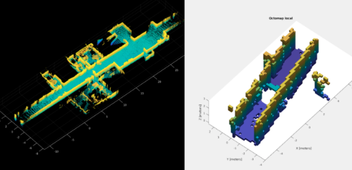

# local_octomap

* Using LiDAR odom data and the global map generated by any of the LOAMS.
* LiDAR data and map generation can work in real time.
* The algorithm uses the occupancy function from matlabs's navigation
  toolbox.

